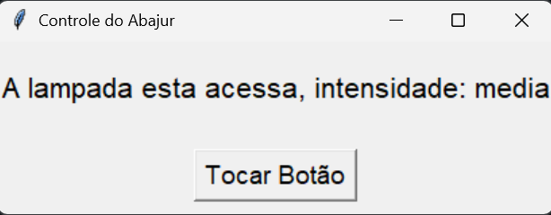

# 💡 TkAbajur

Simples simulação de um abajur feito com Python e Tkinter. A cada clique no botão, a luz muda de intensidade: apagada → fraca → média → forte → apagada.

## 🎮 Como funciona?

- O botão "Tocar Botão" aumenta a intensidade da luz.
- Existem 4 níveis de intensidade: apagada, fraca, média e forte.
- Quando chega no máximo, volta para o início.
- A interface mostra o status da lâmpada em tempo real.

## 🧠 Tecnologias usadas

- Python 3
- Tkinter (interface gráfica)
- POO (Programação Orientada a Objetos)

 ## 🖥️ Interface



## ▶️ Como executar

1. Clone este repositório:
   ```bash
   git clone https://github.com/Xandi-avila/Abajur-Interativo.git

2. Acesse a pasta do projeto:
     ```bash
   cd abajur4

3. Execute o projeto
   ```bash
   python main.py
